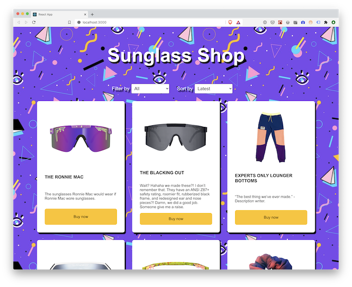
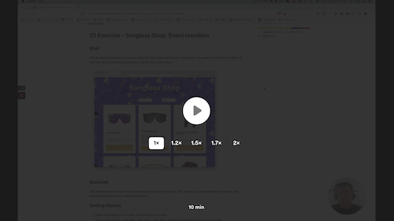

# 01 Exercise - Sunglass Shop: Event Handlers

## Brief

The Sunglass eCommerce site has some features that require user interaction. You need to add event handlers to the Filter by and Sort by dropdowns, and the Buy Now button.



## Rationale

Web applications normally require some type of user interaction. This requires an understanding of how to use event handlers to invoke callback functions.

## Getting Started

1. Open the project in VS Code, and open your terminal
2. Type: `npm install` and then `npm start`. The React Application should open in your browser
3. Open `src/App.jsx` in VS Code.

## Instructions Part A - `FilterBy` component

When a customer changes the _Filter by_ dropdown, the product list will update to display only products of the category type. For now, you will set up the event handler that will eventually implement this functionality. You will make a browser alert be displayed when the user changes the dropdown.

Because the _Filter by_ dropdown will affect the product list, the callback function needs to be in the same place the products are used, which is `./src/App.jsx`.

### Video code along

A video code along has being created for Part A. Follow along, otherwise read the instructions below if you prefer text based instructions.

<a href="https://www.loom.com/share/7a6808a9ec364cb99edfb827449c4784">
  
  <p>Sunglass Shop: Event Handlers: Part A code along (10mins)</p>
</a>

### OR written instructions

1. Before the `App` component, create a new function named `setFilterBy`.

   - This function should accept one parameter: `filterBy`. This is the value that the component will pass into this callback function.
   - When the function is called, it should alert the `filterBy` parameter:

     ```js
     const setFilterBy = (filterBy) => {
       alert(`Filter by: ${filterBy}`);
     };
     ```

2. Now you have a function created, you need to pass it to the `<FilterBy />` component, so you can call it on an event handler. On the `<FilterBy>` component, create a new property named `setFilterBy`, and assign it the `setFilterBy` function:

   ```jsx
   <FilterBy setFilterBy={setFilterBy} />
   ```

3. Open `./src/components/FilterBy.jsx`. Update the component to include the new `setFilterBy` property in the destructured list of properties.
4. Inside the `FilterBy` component, create a new function named `onChange`. It should accept an `event` object as a single parameter.

   ```js
   const onChange = (event) => {};
   ```

5. The `onChange` function should call the `setFilterBy` callback function, and pass in the value of the dropdown as a parameter:

   ```js
   const onChange = (event) => {
     setFilterBy(event.target.value);
   };
   ```

6. Finally, attach an event handler to the `<select>` element, and call the `onChange` function when the `onChange` event fires:

   ```jsx
   <select onChange={onChange}>
   ```

7. Test that your event handler works, by opening the Sunglass Shop in your web browser, and changing the _Filter by_ dropdown. It should display a browser alert with the new value

**Acceptance criteria**

- When the _Filter by_ dropdown is changed, a browser alert displays with the selected value from the dropdown, i.e `sunglasses`, `accessories` or `all`

## Instructions Part B - `SortBy`

Repeat the process from Part A for the `SortBy` component.

### Video code along

<a href="https://www.loom.com/share/12f7b766ab4747b7b21141cc52f5d618">
  
  <p>Sunglass Shop: Event Handlers: Part B code along (3mins)</p>
</a>

**Acceptance criteria**

- When the _Sort by_ dropdown is changed, a browser alert displays with the selected value from the dropdown, i.e `latest`, `high` or `low`

## Instructions Part C - Buy now

### Video code along

A video code along has being created for Part C. Follow along, otherwise read the instructions below if you prefer text based instructions.

<a href="https://www.loom.com/share/1765b53c27ab4dbea2c46981630be8cd">
  
  <p>Sunglass Shop: Event Handlers: Part C code along (2mins)</p>
</a>

### OR written instructions

When a customer clicks the _Buy now_ button, they will be redirected to a checkout page. For now, you will set up the event handler that will eventually implement this functionality.

Because the _Buy now_ button only affects a single product, the callback function can go directly into `./src/components/Product.jsx`

1. Open `./src/components/Product.jsx` in VS Code. Inside the `Product` component, before the `return` statement, create a new function named `onClick`:

   ```js
   const onClick = () => {};
   ```

2. When the `onClick` function is called, it should alert the product name:

   ```js
   const onClick = () => {
     alert(`Checkout: ${name}`);
   };
   ```

3. On the `<button>` element, add a new event handler that is called `onClick`:

   ```jsx
   <button onClick={onClick}>Buy now</button>
   ```

4. Test the event handler works correctly, by opening the application in your browser and clicking the _Buy now_ button for different products

**Acceptance criteria**

- When a _Buy now_ button is clicked, it displays a browser alert with the correct product name

---

# Submit your Exercise

- [ ] Commits are pushed to GitHub
- [ ] Automated tests pass in GitHub
